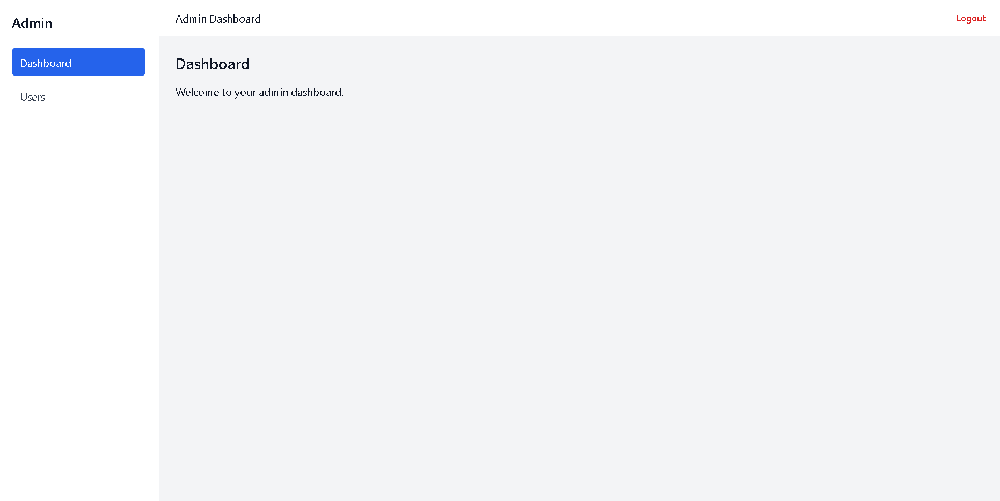
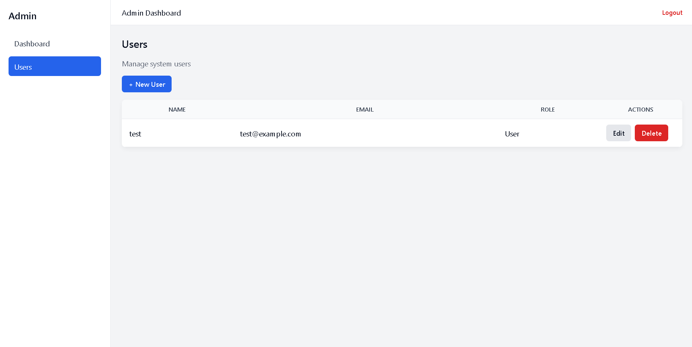
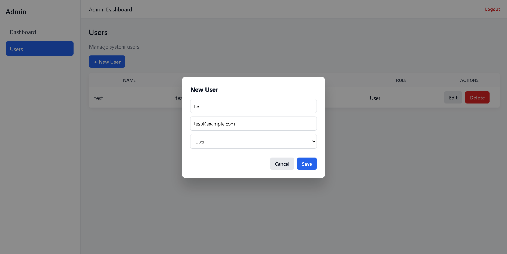
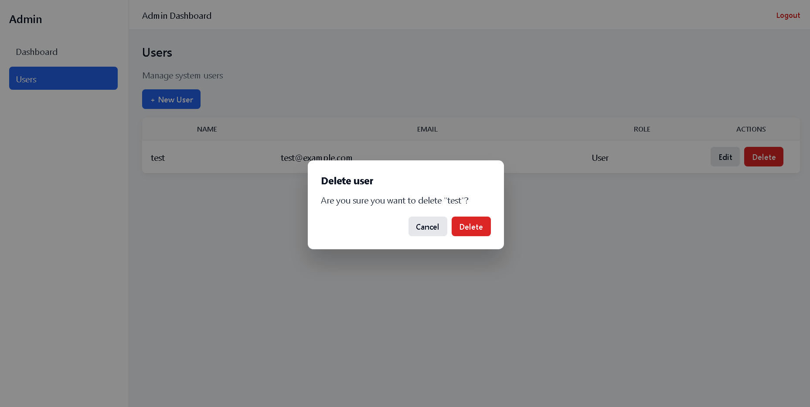
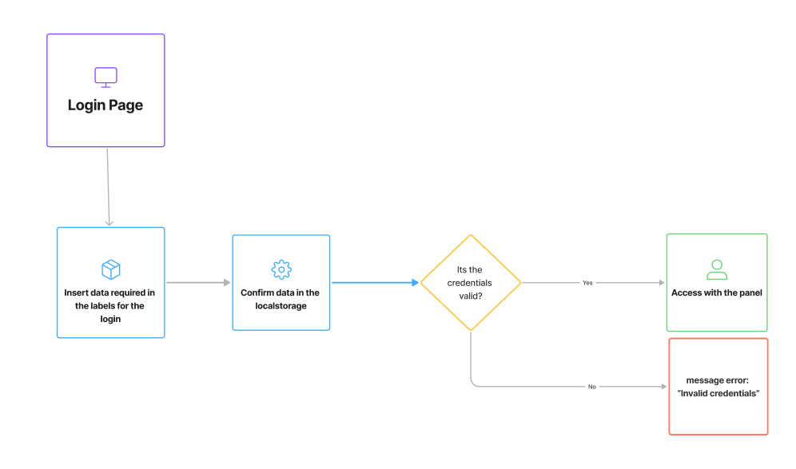

# React Admin Dashboard Starter

## A clean and lightweight React Admin Dashboard Starter built with modern React practices.

This project provides a solid foundation for admin panels, internal tools, and SaaS back-offices, focusing on clarity, usability, and extensibility — without relying on heavy UI frameworks.

## ✨ Features

- 🔐 Authentication flow (demo-ready)
- 📊 Admin layout with sidebar and header
- 👥 Users management (CRUD)
- ✏️ Create, edit and delete users
- ⚠️ Confirmation modal for destructive actions
- 💾 LocalStorage persistence
- 🧩 Reusable modals (Create / Edit / Confirm Delete)
- 🔔 Toast notifications (non-blocking UX feedback)
- 🎯 Clean and scalable project structure
- 🎨 Custom CSS (no UI libraries)
- 📸 Screenshots

## Login System

## Dashboard Layout

## Users Management

## Create / Edit User

## Confirm Delete

## Flowchart

## 🏗️ Project Structure
```text
src/
 ├ components/
 │   ├ Sidebar.jsx
 │   ├ Header.jsx
 │   ├ UserModal.jsx
 │   ├ ConfirmModal.jsx
 │   └ Toast.jsx
 ├ pages/
 │   ├ Login.jsx
 │   ├ Dashboard.jsx
 │   └ Users.jsx
 ├ services/
 │   ├ auth.service.js
 │   └ users.service.js
 ├ hooks/
 │   └ useToast.js
 ├ layouts/
 │   └ AdminLayout.jsx
 ├ styles/
 │   └ *.css
```
## 🚀 Getting Started
1. 1️⃣ Install dependencies
```npm install```

2. 2️⃣ Run the project
```npm run dev```

## 🧠 How it works
- Authentication
- Authentication is simulated using localStorage.
- It can easily be replaced with a real authentication system.
- Users CRUD
- Create new users
- Edit existing users
- Delete users with confirmation
- Data is persisted using localStorage

## 🎯 Use cases
### This project is ideal for:
- Admin dashboards
- Internal company tools
- SaaS back-office panels
- Freelance starter projects
- Learning modern React architecture

## 🛠️ Tech Stack
- React
- Vite
- React Router
- Vanilla CSS
- LocalStorage

## 📄 License

Free to use and modify for personal or commercial projects.
